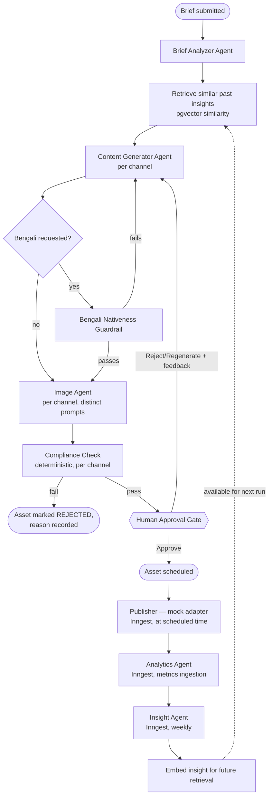

# Agent Design

The full pipeline, implemented as a LangGraph state graph running in-process within the Next.js app (`lib/agents/graph.ts` — see `architecture/SYSTEM_ARCHITECTURE.md` for why this is in-process rather than a separate service).

## The graph



This differs from the GPT-drafted plan in two structural ways, both deliberate:

1. **Compliance Check is not an "agent"** in the LLM sense — it's deterministic validation. See `architecture/DECISIONS.md` ADR-005.
2. **A Bengali Nativeness Guardrail sits between generation and image generation**, not left as a one-time manual check before the demo. See §2 below and `agents/GUARDRAILS.md`.

## Stage-by-stage

### 1. Brief Analyzer Agent
- **Input:** raw brief text (e.g. "Promote new Bengali thriller launching next month")
- **Output (structured, Zod-validated):** `{ genre, targetAudience, language: "bn" | "en" | "both", tone, targetChannels }`
- Retries once on schema validation failure; flags for manual review on a second failure rather than guessing (`product/ACCEPTANCE_CRITERIA.md` AC 2.1)

### 2. Insight retrieval (not an agent — a direct pgvector query)
- Embeds the current brief, retrieves the top-k most similar past `InsightEmbedding` rows
- Retrieved insights are injected into the Content Generator's prompt context as "here's what worked in similar past campaigns" — this is the mechanism, not just the intention, behind "insights feed back into the next brief" (`docs/CONTEXT.md` disqualifier #3)

### 3. Content Generator Agent
- Runs once per target channel, producing copy + CTA + hashtags in the requested language(s)
- Each channel gets a **distinct prompt template** encoding that channel's tone/length/hashtag convention (see `agents/AGENT_PROMPTS.md`) — not one generic prompt with a "make it fit Instagram" instruction appended
- Receives retrieved past-insight context (stage 2) and, on a Regenerate, the reviewer's rejection feedback

### 4. Bengali Nativeness Guardrail
- Only runs when the brief requests Bengali output
- A lightweight secondary LLM call judges whether the generated Bengali text reads as natively written or as translated phrasing (see `agents/GUARDRAILS.md` §2 for the exact prompt and pass/fail handling)
- On failure: retries generation once (optionally routing to Sarvam AI instead of Gemini, if configured); on a second failure, flags the asset rather than silently shipping translation-quality output

### 5. Image Agent
- Runs once per target channel, with a **separately composed prompt per channel** — e.g. Instagram gets a close, cinematic, minimal-text composition; Facebook gets a wider, more informative layout; X gets a high-contrast, attention-grabbing composition
- This directly targets the project's #1 auto-disqualifier: three genuinely different generation calls, never one image resized/relabeled three ways (`product/ACCEPTANCE_CRITERIA.md` AC 5.1)
- Calls the image generation client (`lib/ai/imageGen.ts`, wrapping Hugging Face FLUX or Replicate)

### 6. Compliance Check (deterministic, not an LLM call)
- Validates the generated copy + image against the target channel's actual constraints, read from `lib/channels/`: character limit, aspect ratio, file size, hashtag count
- Fails closed: any rule it can't confidently evaluate is treated as a failure requiring manual review, not a silent pass
- On failure: the asset is marked `REJECTED` with the specific rule and reason recorded (`ComplianceCheck` row) — this never reaches the approval queue as if valid

### 7. Human Approval Gate
- Not an agent — the mandatory human checkpoint described in `product/HITL_CHECKPOINTS.md`
- Approve → asset becomes schedulable
- Reject/Regenerate (with feedback) → routes back to the Content Generator or Image Agent, whichever the reviewer flagged, with the feedback included in the next attempt's prompt

### 8. Publisher (mock)
- Runs as an Inngest function at the scheduled time, not synchronously in the request/response cycle
- Calls the target channel's mock adapter (`lib/channels/`), which **re-validates constraints before "publishing"** — a second enforcement point, matching the problem statement's explicit requirement that the adapter layer reject invalid content (`product/ACCEPTANCE_CRITERIA.md` AC 12.2)
- Produces a `PublishedPost` record with a realistic mock post ID

### 9. Analytics Agent
- Runs as an Inngest function, either generating plausible demo metrics or ingesting an uploaded CSV
- Purely data ingestion — no generation or judgment happens here

### 10. Insight Agent
- Runs weekly (Inngest scheduled function)
- Performs the cross-platform, like-for-like comparison (a direct join on `briefId`, not semantic matching — see `architecture/DOMAIN_MODEL.md`)
- Generates the AI-written report, with every claim required to cite specific post IDs (`product/ACCEPTANCE_CRITERIA.md` AC 16.1) — see `agents/GUARDRAILS.md` for the grounding check applied to this output
- Embeds the report's key insights into `InsightEmbedding` for retrieval by future runs (stage 2) — this is what closes the loop

## State passed through the pipeline

```ts
{
  briefId: string;
  rawBrief: string;
  spec?: CampaignSpec;
  retrievedInsights?: InsightSnippet[];
  assets: {
    channel: "instagram" | "facebook" | "twitter";
    copy?: { bn?: string; en?: string; cta: string; hashtags: string[] };
    bengaliNativenessCheck?: { passed: boolean; attempt: number };
    image?: { url: string; prompt: string };
    complianceResult?: { passed: boolean; failures: ComplianceFailure[] };
    status: "generating" | "pending_approval" | "approved" | "rejected" | "scheduled" | "published";
  }[];
}
```

This state is ephemeral per pipeline run for the synchronous stages (1–6); once an asset reaches `APPROVED`, its durable record lives in Postgres and the async stages (8–10) work from the database, not from in-memory graph state — a server restart between approval and the scheduled publish time must not lose anything.

## Error handling

- If Content Generator fails for one channel, the other channels' generation still proceeds — one channel's failure shouldn't block the whole brief (mirrors the partial-failure pattern from `engineering/ERROR_HANDLING.md`).
- If Image Agent fails, the corresponding copy asset can still go to approval with a "regenerate image" action available, rather than discarding the whole channel's work.
- Regeneration is capped at 2 automatic attempts per asset before requiring manual intervention (`agents/GUARDRAILS.md` §4) — this bounds both cost and the risk of an infinite Reject→Regenerate loop.
