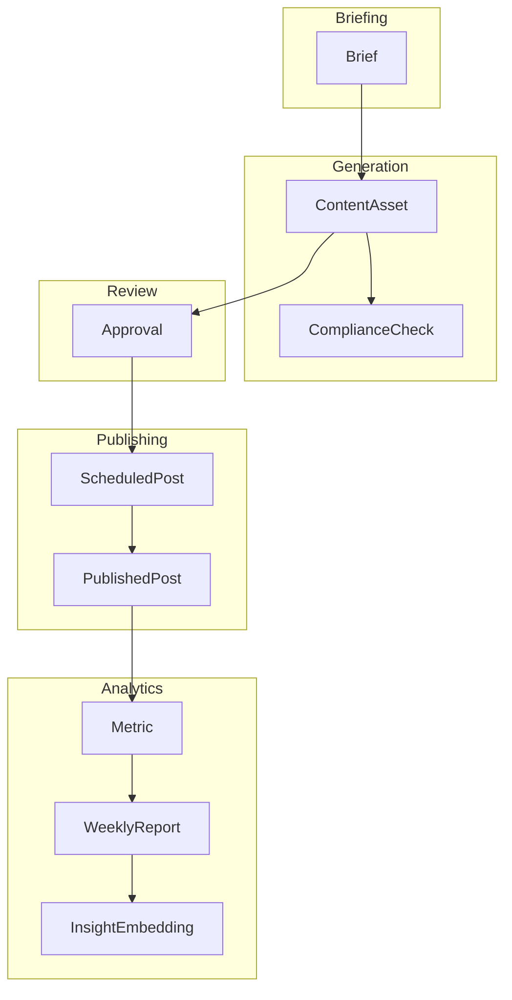

# Domain Model

Conceptual companion to `prisma/schema.prisma`, which is the source of truth for field-level types and constraints.

## Bounded contexts

### Briefing
`Brief` — raw text, the parsed structured spec, and its own `embedding` field (a vector representation used to retrieve similar past briefs/insights for the next campaign — stored directly on `Brief`, not a separate table, since each brief needs exactly one embedding).

### Generation
`ContentAsset` — one row per (brief, channel, type [copy/image]) combination, holding the generated content, its version number (incremented on regenerate), and its status. `ComplianceCheck` — one row per asset per rule evaluated, recording pass/fail and the reason, so a rejection is always explainable.

### Review
`Approval` — records every Approve/Reject/Regenerate decision, with optional feedback text (used to inform regeneration). Append-only — a full history of review decisions per asset, not just the current status.

### Publishing
`ScheduledPost` — an approved asset with a scheduled time. `PublishedPost` — created once the mock adapter fires, holding the mock platform post ID and timestamp.

### Analytics
`Metric` — performance data per published post (views, likes, shares, comments), tagged with its source (`MOCK` or `CSV_UPLOAD`). `WeeklyReport` — the AI-generated summary, referencing specific post IDs. `InsightEmbedding` — the embedded, retrievable form of a report's key takeaways, feeding the next brief's analysis.

## Key modeling decisions

- **`ContentAsset` is per-channel, not a single row with per-channel columns.** This makes "three genuinely distinct assets per brief" a structural fact of the schema, not something that has to be enforced by convention — you cannot accidentally store "one image, three platform labels" without it being three separate `ContentAsset` rows, each with their own generated content and their own compliance check.
- **`ComplianceCheck` is a separate table, not a boolean on `ContentAsset`.** This preserves the *reason* for rejection (which specific rule failed) rather than collapsing it to pass/fail, which is what makes AC 6.1's "clear reason when an asset is rejected" possible.
- **`Approval` is append-only, keyed by asset + version.** Regenerating an asset creates a new version; approval history is preserved per version, so "what did the reviewer say about attempt 1 vs. attempt 2" is always answerable.
- **`Metric.source` distinguishes mock-generated from CSV-uploaded data.** This matters for demo honesty — the weekly report and comparison views can (and should) indicate which posts have real vs. synthetic performance data.
- **`Brief.embedding` and `InsightEmbedding` follow the same pattern as the job platform's `profileEmbedding`/`jobEmbedding`** — embeddings live alongside their source data using pgvector on the same Postgres instance rather than a separate vector store. `Brief` gets a single `embedding` field directly (one brief, one embedding); `InsightEmbedding` is its own table because one `WeeklyReport` produces multiple distinct, separately-embedded key insights.

## Naming note

`Channel` is stored uppercase (`INSTAGRAM`/`FACEBOOK`/`TWITTER`) at the database layer, matching every other enum in this schema. Application code uses a lowercase equivalent — see `engineering/CODING_STANDARDS.md` "Channel casing convention" for the one place that conversion happens.

## Cross-context relationships worth calling out

- **Cross-platform comparison (`product/ACCEPTANCE_CRITERIA.md` AC 14.1) is a direct `GROUP BY briefId` join across `ContentAsset` → `PublishedPost` → `Metric`** — not a semantic-matching problem. Because every channel's asset is generated from the same brief, "like-for-like" comparison is structurally guaranteed by the schema, not something the comparison logic has to figure out.
- **The insight feedback loop is the one place semantic similarity actually matters** — finding the most *relevant* past brief/insight for a new brief is genuinely a retrieval problem (different campaigns, different genres, no shared foreign key), which is why it's the one part of this domain that uses pgvector similarity rather than a direct join.
