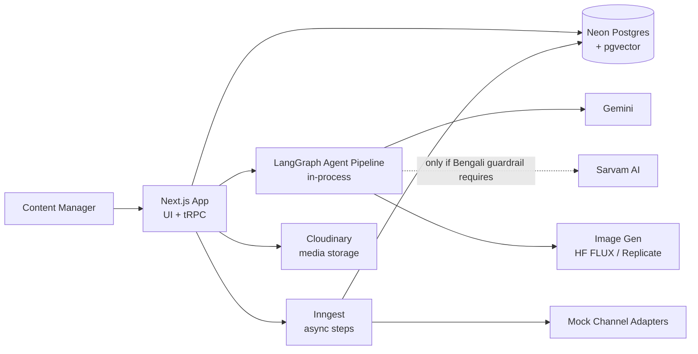
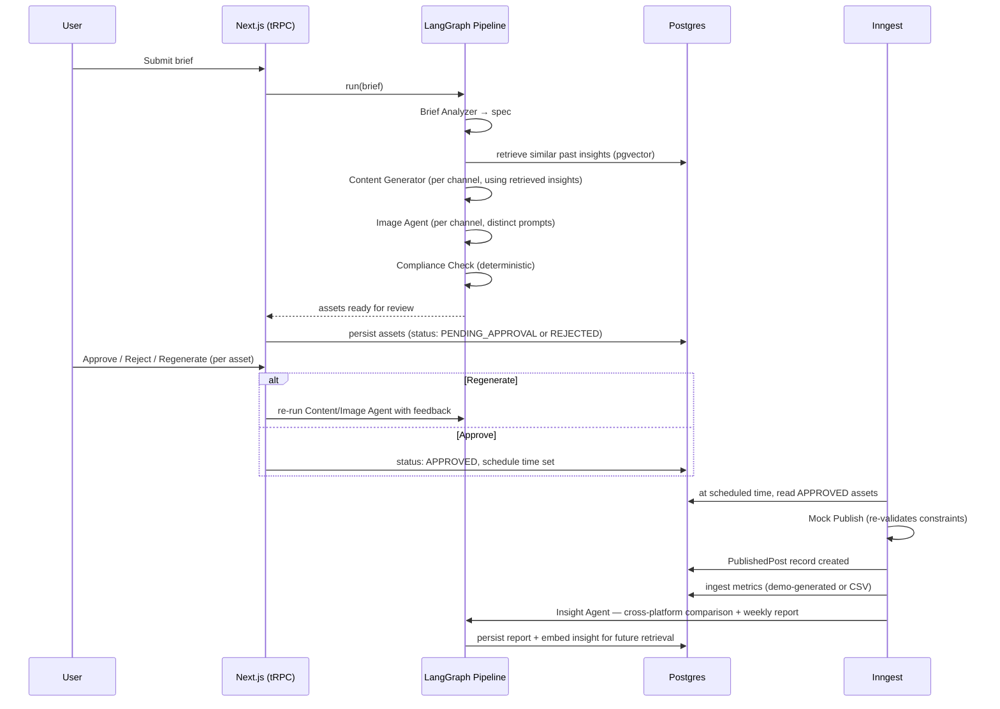

# System Architecture

## Single-app shape

Unlike a production system built for continuous operation, this is a hackathon project with a fixed, short build window — see `architecture/DECISIONS.md` ADR-004 for why it deliberately runs as **one Next.js application** rather than a multi-service architecture.

- **The Next.js app** owns the UI (Studio, Approval, Publisher, Insights) and simple CRUD via tRPC → Prisma.
- **The LangGraph pipeline runs in-process**, invoked directly by tRPC procedures for the synchronous parts (brief analysis → generation → compliance check) — no separate service, no protocol boundary. This is a deliberate simplification versus a production system: there's no need for the MCP-style agent/tool boundary here because there's no multi-service trust boundary to enforce (see ADR-004).
- **Inngest** handles everything that's async or time-based: scheduled publishing, metrics ingestion, and weekly report generation.
- **Mock channel adapters** (`lib/channels/`) simulate Instagram/Facebook/X publishing, including re-validating constraints at publish time (see `product/ACCEPTANCE_CRITERIA.md` AC 12.2).

## The full pipeline, end to end

## Why compliance checking is not an agent call

The problem statement's "toughest test" explicitly requires that constraint violations be *rejected, not silently accepted*. An LLM-based "compliance agent" can itself be wrong or inconsistent between runs. This project implements the Compliance Check as **deterministic, rule-based code** reading each channel's actual constraints (`lib/channels/`) — character count, aspect ratio, file size are all directly computable, not judgment calls. See `architecture/DECISIONS.md` ADR-005.

## Why the insight feedback loop uses pgvector, not just a stored report

The project's #3 auto-disqualifier is "insights that live on a dashboard but never reach brief creation." A report that's merely *displayed* doesn't satisfy this — it has to be *retrieved and used* as input to the next generation run. This project embeds each weekly report's key insights (and/or each brief + its outcome) and retrieves the most similar past insight(s) via pgvector cosine similarity whenever a new brief is analyzed, injecting that into the Brief Analyzer/Content Generator's prompt context. This is a real, inspectable RAG loop — not a report nobody reopens.

## Data flow ownership

| Concern | Owner |
|---|---|
| Brief submission, asset review, scheduling UI | Next.js app (tRPC → Prisma) |
| Brief analysis, generation, compliance checking | LangGraph pipeline, in-process |
| Scheduled/async execution (publish, metrics, report) | Inngest |
| Media storage | Cloudinary |
| Insight retrieval | pgvector, queried directly from the pipeline |

## Related documents

- `architecture/AGENT_DESIGN.md` — the 8-stage agent pipeline in detail
- `architecture/DOMAIN_MODEL.md` — the underlying data model
- `architecture/DECISIONS.md` — the tradeoffs behind this shape
